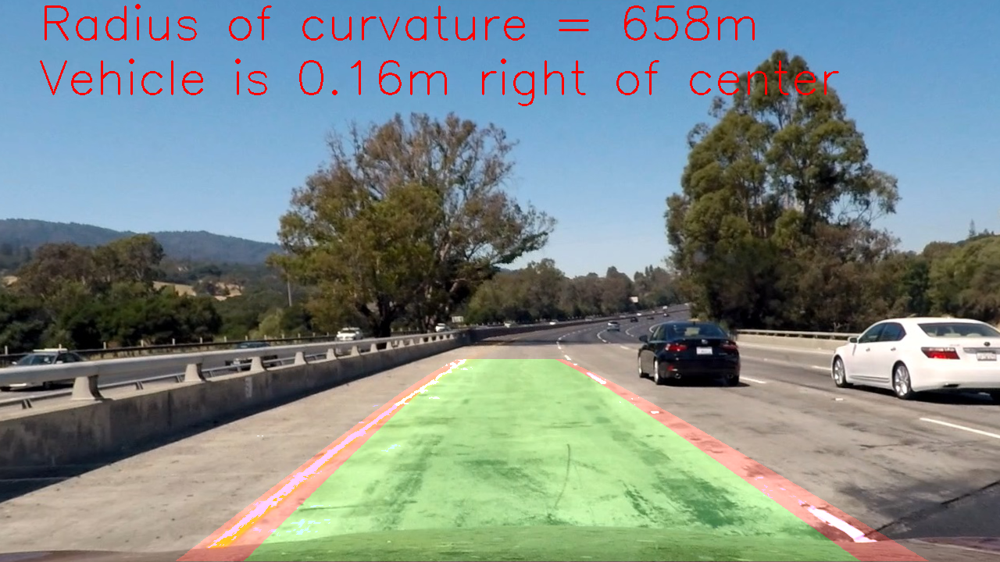

# Writeup

This is my writeup for the project "Advanced Lane Finding" of Self Driving Car Nanadegree on Udacity.

---

## Contents

* [About Advanced Lane Finding Project](#About-Advanced-Lane-Finding-Project)
* [Project code](#Project-code)
* [Note](#Note)
* [Rubric Points](#Rubric-Points)
* [Camera Calibration](#Camera-Calibration)
* [Pipeline (single images)](#Pipeline-single-images)
* [Pipeline (video)](#Pipeline-video)
* [Discussion](#Discussion)

[//]: # (Image References)

[test1]: ./test_images/test1.jpg "test1 - Original"
[test1_gradx]: ./output_binary_images/gradx_test1.jpg "test1 - Grad X"
[test1_grady]: ./output_binary_images/grady_test1.jpg "test1 - Grad Y"
[test1_mag]: ./output_binary_images/mag_test1.jpg "test1 - Magnitude"
[test1_dir]: ./output_binary_images/dir_test1.jpg "test1 - Direction"
[test1_color]: ./output_binary_images/color_test1.jpg "test1 - Color"
[test1_hls]: ./output_binary_images/hls_test1.jpg "test1 - HLS S-channel"
[test1_luv]: ./output_binary_images/luv_test1.jpg "test1 - LUV L-channel"
[test1_lab]: ./output_binary_images/lab_test1.jpg "test1 - LAB B-channel"
[test1_combined]: ./output_binary_images/combined_test1.jpg "test1 - Combined"

[test2]: ./test_images/test2.jpg "test2 - Original"
[test2_gradx]: ./output_binary_images/gradx_test2.jpg "test2 - Grad X"
[test2_grady]: ./output_binary_images/grady_test2.jpg "test2 - Grad Y"
[test2_mag]: ./output_binary_images/mag_test2.jpg "test2 - Magnitude"
[test2_dir]: ./output_binary_images/dir_test2.jpg "test2 - Direction"
[test2_color]: ./output_binary_images/color_test2.jpg "test2 - Color"
[test2_hls]: ./output_binary_images/hls_test2.jpg "test2 - HLS S-channel"
[test2_luv]: ./output_binary_images/luv_test2.jpg "test2 - LUV L-channel"
[test2_lab]: ./output_binary_images/lab_test2.jpg "test2 - LAB B-channel"
[test2_combined]: ./output_binary_images/combined_test2.jpg "test2 - Combined"

[straight2]: ./test_images/straight_lines2.jpg "straight_lines2 - Original"
[straight2_gradx]: ./output_binary_images/gradx_straight_lines2.jpg "straight_lines2 - Grad X"
[straight2_grady]: ./output_binary_images/grady_straight_lines2.jpg "straight_lines2 - Grad Y"
[straight2_mag]: ./output_binary_images/mag_straight_lines2.jpg "straight_lines2 - Magnitude"
[straight2_dir]: ./output_binary_images/dir_straight_lines2.jpg "straight_lines2 - Direction"
[straight2_color]: ./output_binary_images/color_straight_lines2.jpg "straight_lines2 - Color"
[straight2_hls]: ./output_binary_images/hls_straight_lines2.jpg "straight_lines2 - HLS S-channel"
[straight2_luv]: ./output_binary_images/luv_straight_lines2.jpg "straight_lines2 - LUV L-channel"
[straight2_lab]: ./output_binary_images/lab_straight_lines2.jpg "straight_lines2 - LAB B-channel"
[straight2_combined]: ./output_binary_images/combined_straight_lines2.jpg "straight_lines2 - Combined"

[test1_undistorted]: ./output_images/undistorted_test1.jpg "test1 - undistorted"
[test1_warped]: ./output_images/warped_test1.jpg "test1 - warped"
[test2_undistorted]: ./output_images/undistorted_test2.jpg "test2 - undistorted"
[test2_warped]: ./output_images/warped_test2.jpg "test2 - warped"
[straight_undistorted]: ./output_images/straight_img_undist_lines.jpg "straight line - undistorted"
[straight_warped]: ./output_images/straight_img_warped_lines.jpg "straight line - warped"

[cal2_orig]: ./camera_cal/calibration2.jpg "calibration2.jpg - original"
[cal2_corners]: ./output_images/corners_calibration2.jpg "calibration2.jpg - corners"
[cal2_undistorted]: ./output_images/undistorted_calibration2.jpg "calibration2.jpg - undistorted"
[cal3_orig]: ./camera_cal/calibration3.jpg "calibration3.jpg - original"
[cal3_corners]: ./output_images/corners_calibration3.jpg "calibration3.jpg - corners"
[cal3_undistorted]: ./output_images/undistorted_calibration3.jpg "calibration3.jpg - undistorted"
[cal6_orig]: ./camera_cal/calibration6.jpg "calibration6.jpg - original"
[cal6_corners]: ./output_images/corners_calibration6.jpg "calibration6.jpg - corners"
[cal6_undistorted]: ./output_images/undistorted_calibration6.jpg "calibration6.jpg - undistorted"

[straight_lines1]: ./test_images/straight_lines1.jpg "straight_lines1 - Original"
[straight_lines1_undistorted]: ./output_images/undistorted_straight_lines1.jpg "straight_lines1 - Undistorted"

---

## About Advanced Lane Finding Project

The goals / steps of this project are the following:

* Compute the camera calibration matrix and distortion coefficients given a set of chessboard images.
* Apply a distortion correction to raw images.
* Use color transforms, gradients, etc., to create a thresholded binary image.
* Apply a perspective transform to rectify binary image ("birds-eye view").
* Detect lane pixels and fit to find the lane boundary.
* Determine the curvature of the lane and vehicle position with respect to center.
* Warp the detected lane boundaries back onto the original image.
* Output visual display of the lane boundaries and numerical estimation of lane curvature and vehicle position.

---
## Project code

Here is my working repository for this project:

https://github.com/pl80tech/CarND-Advanced-Lane-Finding

It is imported from below original repository:

https://github.com/udacity/CarND-Advanced-Lane-Finding

---
## Note

In this writeup, some output videos are embedded for demonstratation and explanation. However, video can't be displayed in markdown file when viewing on GitHub due to no support.

To view these embedded videos, please open this file locally in browser (with markdown viewer support). These videos can also be found in "output_videos" folder.

---
## Rubric Points

### Here I will consider the [rubric points](https://review.udacity.com/#!/rubrics/571/view) individually and describe how I addressed each point in my implementation.  

---

### Camera Calibration

#### 1. Briefly state how you computed the camera matrix and distortion coefficients.

Here are the steps I used when calculating the matrix and distortion coefficients for camera calibration.
 
* Prepare a replicated array of coordinates (*objp*) with specific size (*nx = 9, ny = 6*) to handle object points
* Prepare the arrays to save image points (*imgpoints*) & object points (*objpoints*)
* Apply following processes to each calibration image (calibration\*.jpg)
	- Change image to grayscale
	- Call *cv2.findChessboardCorners* to find the chessboard corners
	- If it detects the calibration image successfully, add (append) the detected corners as image points together with a copy of "*objp*" as object points
	- Call *cv2.drawChessboardCorners* to draw the lines connnecting the detected chessboard corners
	- Save the image with detected corners (in */output_images/* folder)
* Apply camera calibration (by calling *cv2.calibrateCamera*) with the imgpoints & objpoints taken above to get the matrix (*mtx*) and distortion coefficients (*dist*) of the camera
* Save the matrix (*mtx*) and distortion coefficients (*dist*) to local file (using pickle) for later use
* Load the saved data (*mtx*, *dist*)
	- *Note:* Doing this can help to avoid running the calibration from the beginning when restarting kernel, etc
* Call *cv2.undistort* to undistort each image with calibrated data (*mtx* & *dist*)
* Save the undistorted images (in */output_images/* folder) 

#### 2. Provide an example of a distortion corrected calibration image.

The output images with detected corners and undistorted images are saved in following path: 

* /output_images/corners_calibration\*.jpg ([link](https://github.com/pl80tech/CarND-Advanced-Lane-Finding/tree/master/output_images)). 

* /output_images/undistorted_calibration\*.jpg ([link](https://github.com/pl80tech/CarND-Advanced-Lane-Finding/tree/master/output_images)). 

Here are some examples of the undistorted image, showing together with its original image & image with detected corners for easy comparison:

| Original image              | With detected corners       | Undistorted image              |
|:---------------------------:|:---------------------------:|:------------------------------:|
|![alt text][cal2_orig]       |![alt text][cal2_corners]    |![alt text][cal2_undistorted]   |
|![alt text][cal3_orig]       |![alt text][cal3_corners]    |![alt text][cal3_undistorted]   |
|![alt text][cal6_orig]       |![alt text][cal6_corners]    |![alt text][cal6_undistorted]   |

### Pipeline - single images

#### 1. Provide an example of a distortion-corrected image.

Here are the example results after applying the distortion-corrected process mentioned above to the raw images in "/test_images/" folder:

| Test image           | Original image                | Undistorted image                        |
|:--------------------:|:-----------------------------:|:----------------------------------------:|
|test1.jpg             |![alt text][test1]             |![alt text][test1_undistorted]            |
|straight_lines1.jpg   |![alt text][straight_lines1]   |![alt text][straight_lines1_undistorted]  |

*Note:* All undistorted output images can be found in following paths: 

* /output_images/undistorted_test\*.jpg ([link](https://github.com/pl80tech/CarND-Advanced-Lane-Finding/tree/master/output_images)).
 
* /output_images/undistorted_straight\*.jpg ([link](https://github.com/pl80tech/CarND-Advanced-Lane-Finding/tree/master/output_images)).

#### 2. Describe how (and identify where in your code) you used color transforms, gradients or other methods to create a thresholded binary image.  Provide an example of a binary image result.

I implemented below helper functions to generate a binary image with various thresholds of color & gradient:

* *abs_sobel_thresh()*: create a binary image with the given sobel kernel size and threshold values of gradient (on x & y orientation)
* *mag_thresh()*: create a binary image with the given sobel kernel size and threshold values of gradient magnitude
* *dir_threshold()*: create a binary image with the given sobel kernel size and threshold values of gradient direction
* *color_thresh()*: create a binary image with a given range of color
* *hls_select()*: create a binary image with the threshold of S-channel on HLS
* *luv_select()*: create a binary image with the threshold of L-channel on LUV
* *lab_select()*: create a binary image with the threshold of B-channel on LAB
* *combined_thresh()*: create a binary image by combining several thresholds

To easily select thresholding method for processing & tuning image/video, I implemented *thresh_binary()* which can call below methods by specifying *threshold_method*:

* *threshold_method* = 1 => Gradient threshold (x axis) 
* *threshold_method* = 2 => Gradient threshold (y axis)
* *threshold_method* = 3 => Magnitude threshold
* *threshold_method* = 4 => Direction threshold
* *threshold_method* = 5 => Color threshold (grayscale)
* *threshold_method* = 6 => S-Channel (HLS) threshold
* *threshold_method* = 7 => L-Channel (LUV) threshold
* *threshold_method* = 8 => B-Channel (LAB) threshold
* *threshold_method* = 9 => Combined threshold

Here are the output images with some combinations of gradient & color threshold:

| Threshold method              | test1.jpg                  | test2.jpg                  | straight2.jpg                  |
|:-----------------------------:|:--------------------------:|:--------------------------:|:------------------------------:|
| Original                      |![alt text][test1]          |![alt text][test2]          |![alt text][straight2]          |
| Gradtitude X                  |![alt text][test1_gradX]    |![alt text][test2_gradX]    |![alt text][straight2_gradX]    |
| Gradtitude Y                  |![alt text][test1_gradY]    |![alt text][test2_gradY]    |![alt text][straight2_gradY]    |
| Magnitude                     |![alt text][test1_mag]      |![alt text][test2_mag]      |![alt text][straight2_mag]      |
| Direction                     |![alt text][test1_dir]      |![alt text][test2_dir]      |![alt text][straight2_dir]      |
| Color                         |![alt text][test1_color]    |![alt text][test2_color]    |![alt text][straight2_color]    |
| HLS S-Channel                 |![alt text][test1_hls]      |![alt text][test2_hls]      |![alt text][straight2_hls]      |
| LUV L-Channel                 |![alt text][test1_luv]      |![alt text][test2_luv]      |![alt text][straight2_luv]      |
| LAB B-Channel                 |![alt text][test1_lab]      |![alt text][test2_lab]      |![alt text][straight2_lab]      |
| Combined                      |![alt text][test1_combined] |![alt text][test2_combined] |![alt text][straight2_combined] |

* Others:

	All thresholded binary image (generated from test images) are shown in ThresholdedImage.md ([link](https://github.com/pl80tech/CarND-Advanced-Lane-Finding/blob/master/ThresholdedImage.md))

#### 3. Describe how (and identify where in your code) you performed a perspective transform and provide an example of a transformed image.

Here are the steps I used in my implementation:

* Choose the hard-coded source (*src*) and destination (*dst*) points as follows (similar with the value in template file):
```python
src = np.float32(
    [[(img_size[0] / 2) - 55, img_size[1] / 2 + 100],
    [((img_size[0] / 6) - 10), img_size[1]],
    [(img_size[0] * 5 / 6) + 60, img_size[1]],
    [(img_size[0] / 2 + 55), img_size[1] / 2 + 100]])
dst = np.float32(
    [[(img_size[0] / 4), 0],
    [(img_size[0] / 4), img_size[1]],
    [(img_size[0] * 3 / 4), img_size[1]],
    [(img_size[0] * 3 / 4), 0]])
```
* Pass *src* & *dst* together with targeted binary image (*img*) to function *warped()*
* Inside *warped()*:
	- Call *cv2.getPerspectiveTransform(src, dst)* to calculate the transform matrix (*M*)
	- Call *cv2.warpPerspective()* to execute perpective transform with the calculated matrix (*M*)

Here are some examples of transformed image:

| Test images           | Original image (undistorted)      | Transformed image (warped)        |
|:---------------------:|:---------------------------------:|:---------------------------------:|
| test1.jpg             |![alt text][test1_undistorted]     |![alt text][test1_warped]          |
| test2.jpg             |![alt text][test2_undistorted]     |![alt text][test2_warped]          |
| straight_lines1.jpg   |![alt text][straight_undistorted]  |![alt text][straight_warped]       |

In the perspective transformation of test image with straight lane lines (above), the left & right lane line are nearly in parallel. It means that the selected *src* & *dst* is quite good.

#### 4. Describe how (and identify where in your code) you identified lane-line pixels and fit their positions with a polynomial?

I implemented below search methods to identify lane-line:

* Search method 1: process each frame separately to find lane pixels & fit a polynomial
* Search method 2: use the parameters from last frame to search lane pixels & fit a polynomial 

Here are the main steps I used in my implementation:

##### (1) Find lane pixels

* Take a histogram of the bottom half of the image
* Find the peak of the left and right halves of the histogram as the starting point for the left and right lines
* Define the sliding windows (with optimized size) & step through each window as follows:
	- Search for all nonzero pixels within the window
	- Add/Append the indices of the detected pixels to the lists
	- If the number of detected pixels exceed the threshold (*minpix*), recenter next window on the mean position
* Concatenate the arrays of indices which previously was a list of lists of pixels
* Extract left and right line pixel positions

##### (2) Search around to detect lane pixels & fit the detected lane with color lines

* With search method 1:
	- Find lane pixels as described in (1) for every frame
	- Fit a polynomial from detected pixels
* With search method 2:
	- Load the saved parameters of last frame. If no data is saved (first frame), create it as follows:
		- Find lane pixels as described in (1)
		- Calculate & save polynomial fit parameters for left & right lane
		- Load the saved parameters
	- Set the area of search based on activated x-values within the +/- margin of polynomial function
	- Search for all nonzero pixels within the area
	- Fit a polynomial from detected pixels
	- Check whether the detected lines is suitable for further processing or not by following conditions:
		- Average x-value of both lines are within the image (smaller than 1280)
		- Average distance between right & left lane is within suitable range (bigger than 680 and smaller than 820)
	- If not suitable (sometimes happen), apply search method 1 for current frame

##### (3) Highlight the detected lane lines & moving area with colors

* Define the coordinates for left lane (*left_line_pts*), right lane (*right_line_pts*) & middle area between the 2 lanes (*middle_area*)
* Call *cv2.fillPoly()* to highlight specified areas with specific colors (Red & Green)

The details are implemented with comments for each process in below functions on the [project file](https://github.com/pl80tech/CarND-Advanced-Lane-Finding/blob/master/P2-AdvancedLaneFinding.ipynb):

* *find_lane_pixels()*: find the lane pixels from warped binary image
* *fit_poly()*: fit the second order polynomial from the detected pixels
* *search_around_poly()*: search around the polynomial and draw the lane lines with colors
* *process_image()*: a pipepline to process each image and generate output image with detected lane lines and curvature information

<span style="color:red;">Notes:</span>	
There are some implementations for searching method 3 (using convolution) in the section "Another Sliding Window Search" of [project file](https://github.com/pl80tech/CarND-Advanced-Lane-Finding/blob/master/P2-AdvancedLaneFinding.ipynb). However, it is just for investigating/reference purpose and finally not fine-tuned for using to process the videos. Therefore, it is not explained here.

#### 5. Describe how (and identify where in your code) you calculated the radius of curvature of the lane and the position of the vehicle with respect to center.

Here are the main steps I used to calculate the curvature information.

* Define conversion rate in x and y from pixels space to meters
* Change the given lane coordinates (*ploty, left_fitx, right_fitx* - simulated in previous step) in pixel space to meter space
* Pass the new coordinates (in meter space) to *np.polyfit()* to fit second order polynomials for left & right line
* Use the mathematic equation defined in [link](https://www.intmath.com/applications-differentiation/8-radius-curvature.php) to calculate the left & right curvature radius (*left_curverad*, *right_curverad*) of the lane points whose y-value are correspondent to the bottom of the image.
* Take the average of *left_curverad* & *right_curverad* as final radius of curvature 
* Calculate the position of left line & right lane nearest to the camera then take the average as the center of the 2 lanes (*position*)
* Calculate the distance from center of the lane (*position*) to center of the image. 

The details are implemented with comments for each process in below functions on the project file ([link](https://github.com/pl80tech/CarND-Advanced-Lane-Finding/blob/master/P2-AdvancedLaneFinding.ipynb)):

* *measure_curvature_radius_position()*: calculate radius of curvature & the relative position (distance from center) from simulated lane coordinates
* *add_radius_distance()*: combine the calculated information to the image being processed

#### 6. Provide an example image of your result plotted back down onto the road such that the lane area is identified clearly.

Here is an example of the image with detected lane lines & curvature information:



---

### Pipeline - video

#### 1. Provide a link to your final video output.  Your pipeline should perform reasonably well on the entire project video (wobbly lines are ok but no catastrophic failures that would cause the car to drive off the road!).

Here is my final output from project video, which is generated by using thresholding method 2 (based on color) & searching method 2 (based on prior frame):

| Link on Github           | Link on Youtube  |
|:------------------------:|:---------------------------------:|
| Path to the video on github: [/output_videos/project_video_output.mp4](https://github.com/pl80tech/CarND-Advanced-Lane-Finding/blob/master/output_videos/project_video_output.mp4) <figure class="video_container"> <video controls="true" allowfullscreen="true" width="400" title="Final output from project video file"> <source src="output_videos/project_video_output.mp4" type="video/mp4"> </video> </figure> | [](http://www.youtube.com/watch?v=FqdoX5UH3c8) |

  (*Click on thumbnail image to view the video. The thumbnail for video on Github can be shown when opening this markdown file locally by browsers but may not be shown when viewing directly on Github*)

---

### Discussion

#### 1. Briefly discuss any problems / issues you faced in your implementation of this project.  Where will your pipeline likely fail?  What could you do to make it more robust?

* As shown in output of [project file](https://github.com/pl80tech/CarND-Advanced-Lane-Finding/blob/master/P2-AdvancedLaneFinding.ipynb), 3 test images (calibration1.jpg, calibration4.jpg, calibration5.jpg) can't be processed by current pipeline with specified size (*nx = 9, ny = 6*). The size needs to be adjusted accordingly. The calibration process may be more precise with additional *imgpoints* & *objpoints* taken from these images.
* In comparison with search method 1, search method 2 can be processed more quickly with less computation. However, it may face accuracy problem when processing the frames which are not similar. I faced this issue during the implementation, in which the lane lines disappeared from the middle of project video & can't be detected again. I introduced [a temporary fix](https://github.com/pl80tech/CarND-Advanced-Lane-Finding/commit/f191f1a60587e4f24af8bb60569508e61bf2ae69) to fix that. That is just a temporary solution & can be improved with more refined check condition to make the lane detection more robust.
* As shown in output of [project file](https://github.com/pl80tech/CarND-Advanced-Lane-Finding/blob/master/P2-AdvancedLaneFinding.ipynb), current pipeline works pretty good with project video with only some unstable places when passing through the lanes with shadow. However, when trying with challenge video and especially harder challenge video, current pipeline still performs weakly. Here are some of the potential shortcomings & possible improvements:
	- Current pipeline are using color threshold with fixed threshold values as a default method. It can work well in some situations but it is still weak in others such as the scenes in challenge video ([link to output of challenge video on github](https://github.com/pl80tech/CarND-Advanced-Lane-Finding/blob/master/output_videos/challenge_video_output.mp4)). A more sophisticated thresholding method which combines several methods with more tuning (to detect the lane pixels well in various scenes) may be a possible approach to improve this.
	- Current pipeline performs very poor when detecting the lanes with quick curve as shown in the output of harder challenge video ([link on github](https://github.com/pl80tech/CarND-Advanced-Lane-Finding/blob/master/output_videos/harder_challenge_video_output.mp4)). In addition to a better thresholding method (mentioned above), selecting the source & destination points for perspective transform with more tuning & optimization may be one of the other approaches that help to improve this.
	- Here are the links to the output of challenge videos mentioned above. Click on the thumbnail to view each video on Youtube.

| challenge_video_output.mp4   | harder_challenge_video_output.mp4   |
|:----------------------------:|:-----------------------------------:|
| [](http://www.youtube.com/watch?v=prSs64CYtmk) | [](http://www.youtube.com/watch?v=IJDGBGM_5eU) |
